# Midterm Lab Task 2 -  Data Cleaning and Transformation Using Power Query Editor

## Step 1 - Cleaning the data using PowerQuery Editor
- Download and open the raw data given by your instructor.
- Add the required columns (Min Sal, Max Sal, Role Type).
- Split the columns (Salary Estimate, Location, Size).
- Change the columns to appropriate data types (Currency, Text).
- Filter columns (Competitors, Revenue, Industry to remove negative values).
- Remove unnecessary columns to avoid redundancy (Company Name ratings, extra descriptions).
- Save the M Language to a notepad.
  
  ### Before Cleaning  

    **Uncleaned Image 1.1**

    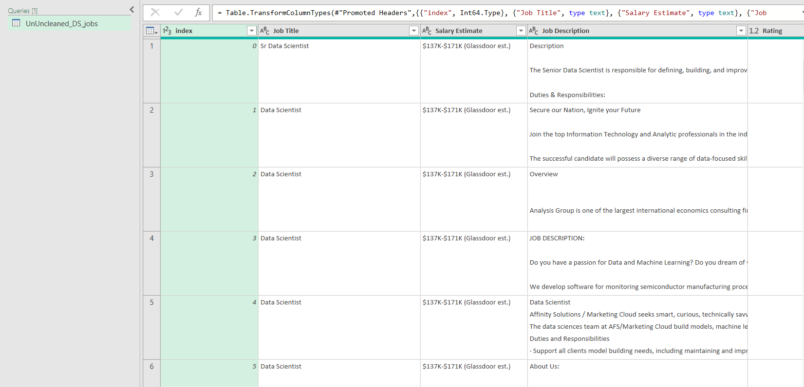  

    **Uncleaned Image 1.2**

    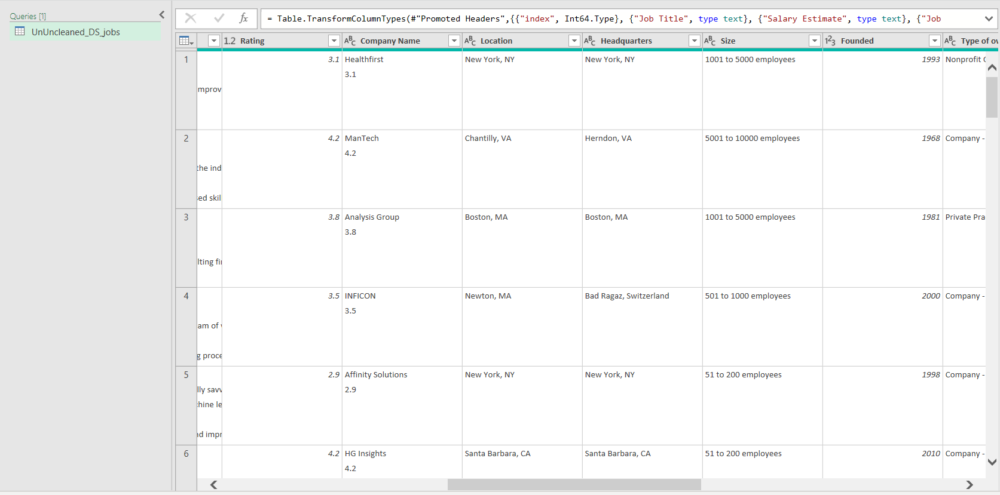  

    **Uncleaned Image 1.3**

    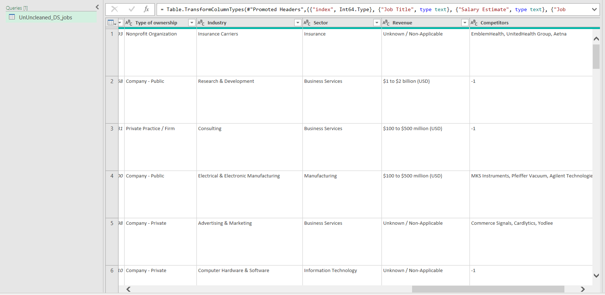  

  ### After Cleaning

    **Cleaned Image 1.1**

    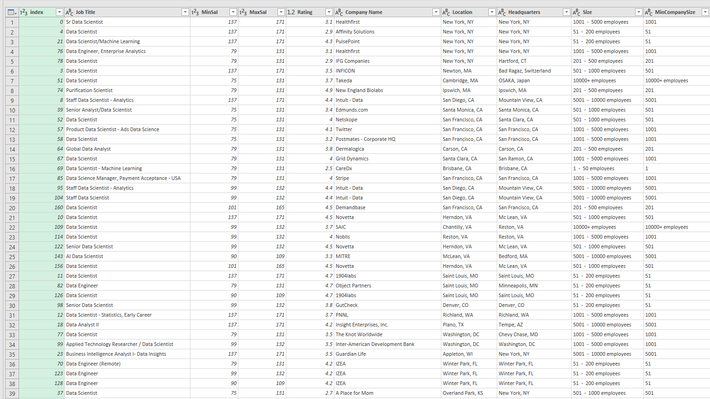

    **Cleaned Image 1.2**

    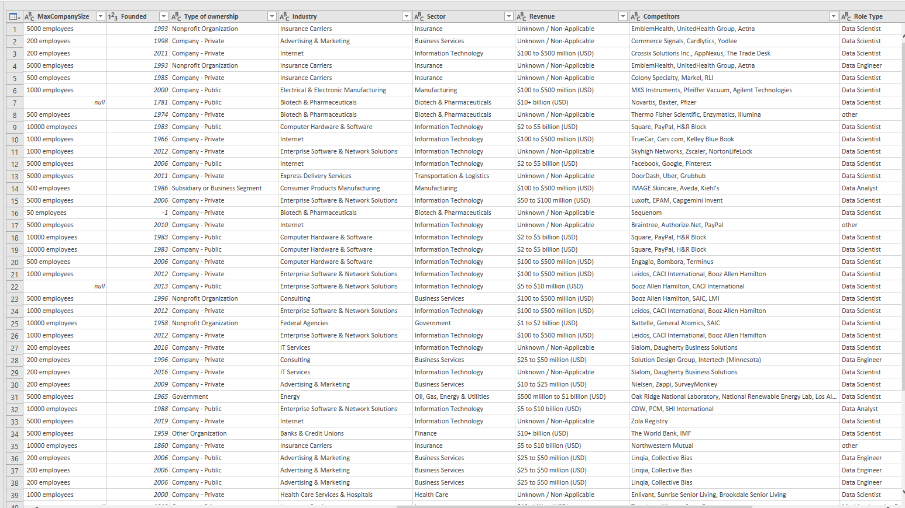

    **Cleaned Image 1.3**

    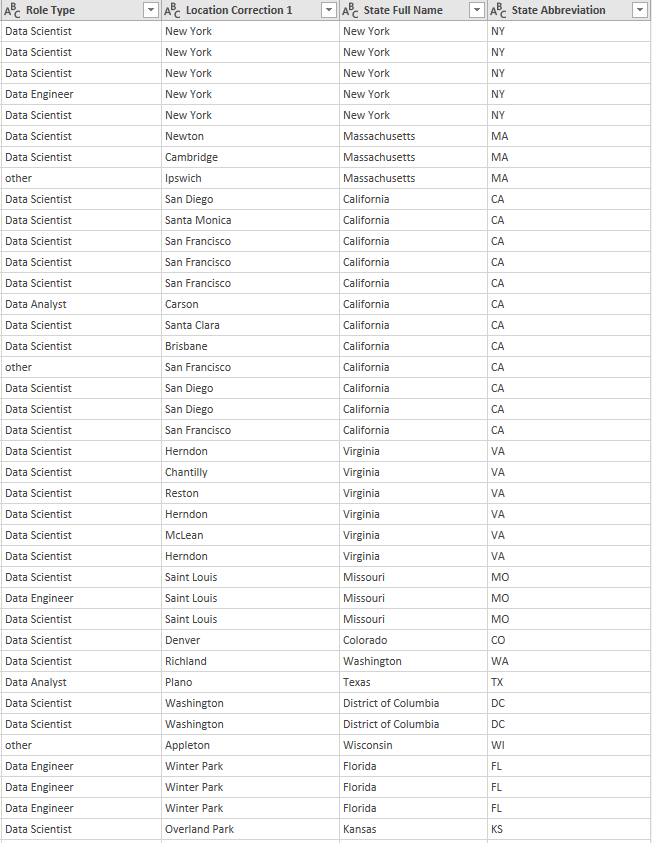

    **M Language**
    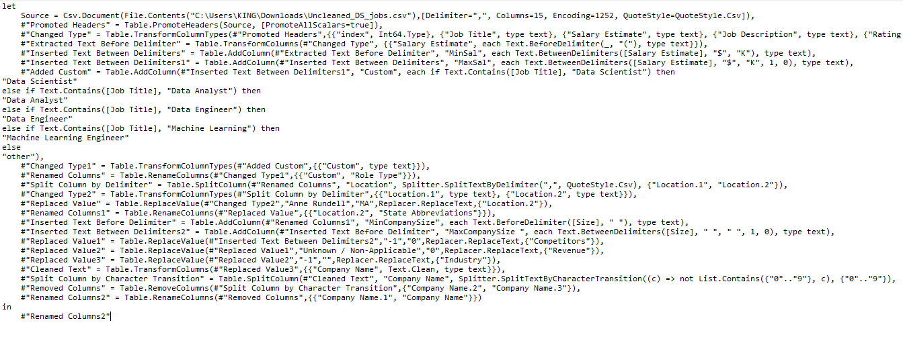

    
## Step 2 - Reshaping and Grouping the Tables
- Duplicate and reference Unclean DS Jobs to create new queries (Sal By Role Type dup, Sal By Role Size ref, Sal By State ref).
- Select appropriate columns (Role Type, Size, Min Sal, Max Sal).
- Change the columns to required data types (Currency).
- Multiply Min Sal and Max Sal by 1000.
- Group data by Role Type, Size, State Full Name to get averages.
- Merge State Mapping with Unclean DS Jobs using State Abbreviation.
- Rename merged column to State Full Name and remove nulls.
- Check and review Query Dependencies.

  ### Grouped Tables

    **Salary by Role Type Table**

    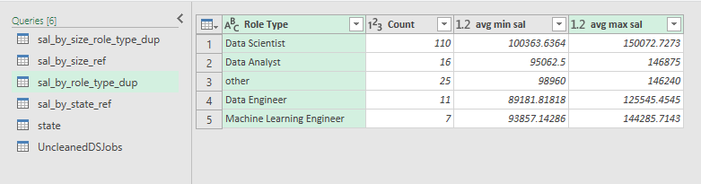

    **Salary by Size Table**

    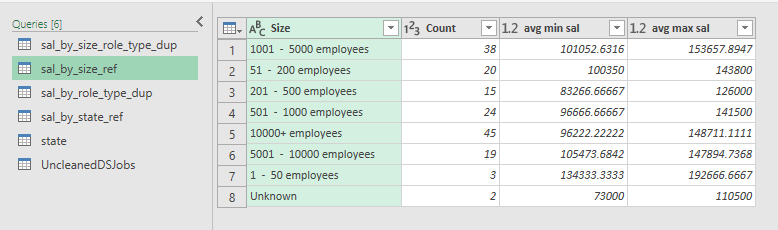

    **Salary by Size Role Type Table**

    

    **Salary by State Table**
  
    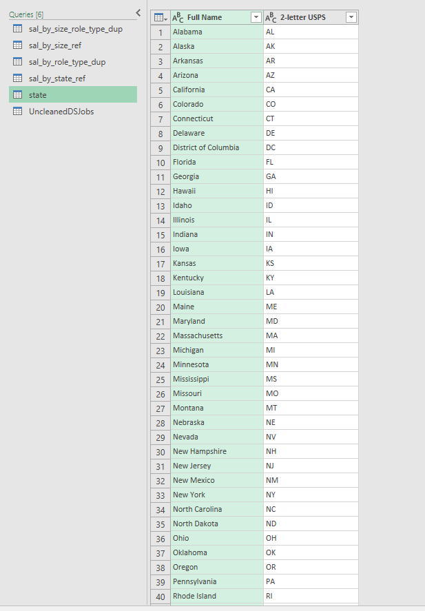

    
    **States (Mapping) Table**

    

  ## Step 3 - Query Dependencies

  - After all the previous steps, check the Query Dependencies in PowerQuery by going to view and selecting the Query Dependencies.
  - Double check whether they are properly linked appropriately.

  ### Image of Query Dependencies 
    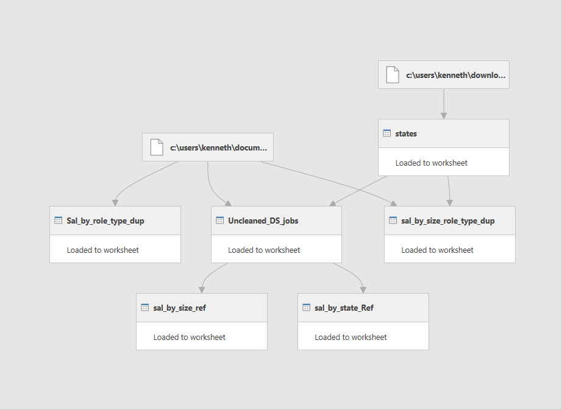
